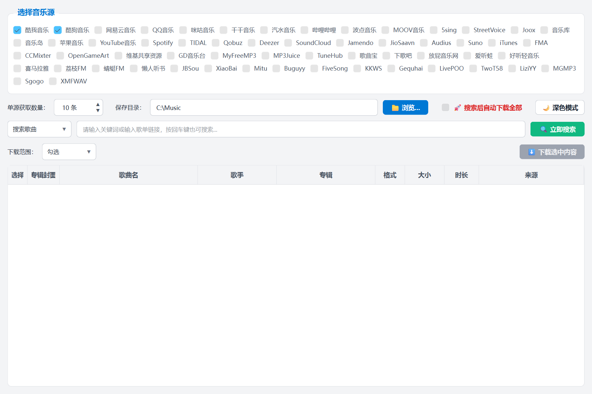
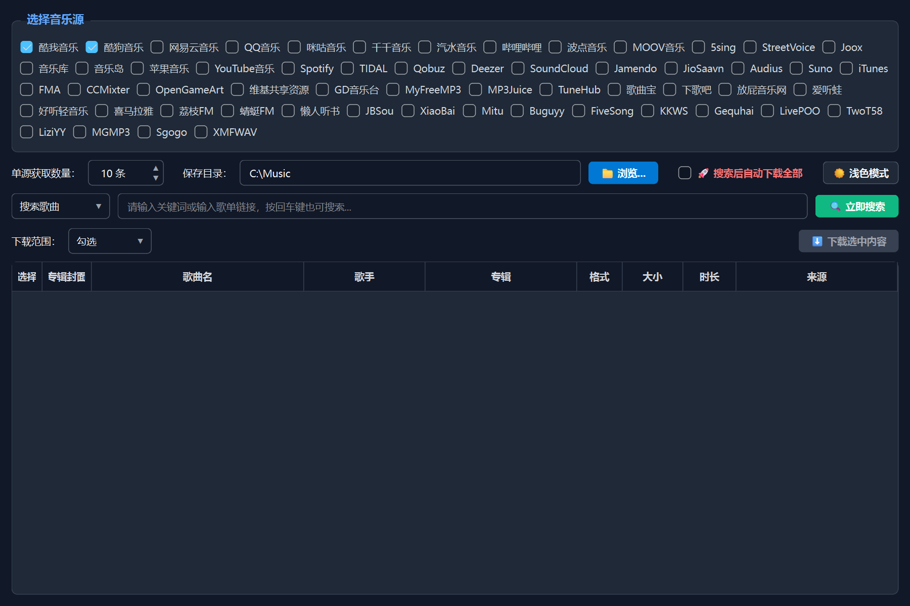

<h1 align="center">MusicDownload</h1>

<p align="center">
  🇺🇸 <a href="./README_EN.md">English</a> | 🇨🇳 <a href="./README.md">简体中文</a>
</p>

<p align="center">
<a href="https://peps.python.org/pep-0719">
</a>
 <a href="https://pypi.org/project/musicdl">
</a>
 <a href="https://github.com/yss161/musicDownload/releases"></a>
 <a></a>
 <a></a>
 <a></a>
 <a></a>

</p>

宇宙超级无敌音乐下载器，支持无损音乐文件下载、批量下载、一键下载，支持歌单下载。

聚合 **57 个音乐源**搜索下载：酷我、酷狗、QQ音乐、网易云、咪咕等国内主流平台，Spotify、TIDAL、YouTube音乐、Deezer 等海外平台，GD音乐台等聚合镜像站，以及喜马拉雅等有声书源。

## ✨ 新版本更新内容

- **音乐源大扩充**：可选音乐源从 17 个扩充到 57 个，源列表从已安装的 musicdl 动态读取——以后升级 musicdl 新增音源无需改代码
- **音源名称翻译**：全部音源中文名显示；聚合源（GD音乐台、TuneHub 等）的搜索结果额外标注真实上游平台，如 `TuneHub(网易云)`
- **深色模式**：右上角一键切换 🌙/☀️，界面、弹窗、右键菜单全套适配，主题偏好自动记忆
- **设置持久化**：音乐源勾选、单源获取数量、保存目录、"搜索后自动下载"开关、搜索模式、主题等全部自动保存到 `musicdownload_config.json`，下次启动自动恢复
- **问题修复**：修复 PySide6 新版本下"🚀 搜索后自动下载全部"开关不生效的问题；修复系统深色模式下部分文字看不见的问题

### 软件截图：

<table align="center" border="0" cellpadding="10">

  <tr>
    <td align="center">
      <br>
      <b>全新界面（浅色）— 57 个音乐源可选</b>
    </td>
  </tr>
  <tr>
    <td align="center">
      <br>
      <b>深色模式</b>
    </td>
  </tr>
</table>

### 设置自动保存：

所有设置（音乐源勾选、单源获取数量、保存目录、自动下载开关、搜索模式、深色模式）会自动保存到程序目录下的 `musicdownload_config.json`，下次启动自动恢复，无需重复配置。

### 使用教程：

```bash
# 需要 Python 3.13+（3.14 已验证可用）
git clone https://github.com/yss161/musicDownload.git
cd musicDownload
python -m venv venv
venv\Scripts\activate
pip install -r requirements.txt
python musicdownload.py
```

### 打包教程：

```
# 需要 Python 3.13+（3.14 已验证可用）
git clone https://github.com/yss161/musicDownload.git
cd musicDownload
python -m venv venv
venv\Scripts\activate
pip install -r requirements.txt

# 如果你是Windows系统，运行make_release.bat文件
.\make_release.bat

# 如果你是Linux、MacOS系统，运行make_release.sh文件
bash make_release.sh
```

## 📌 原项目与致谢

本项目基于以下开源项目修改而来，感谢原作者：

- **GUI 界面来源**：[MrsEWE44/musicDownload](https://github.com/MrsEWE44/musicDownload)（在其基础上增加了源选择持久化、音源翻译、深色模式等新功能）
- **核心搜索/下载库**：[CharlesPikachu/musicdl](https://github.com/CharlesPikachu/musicdl)（原 GUI 基于 [musicdlgui.py](https://github.com/CharlesPikachu/musicdl/blob/master/examples/musicdlgui/musicdlgui.py) 修改）
